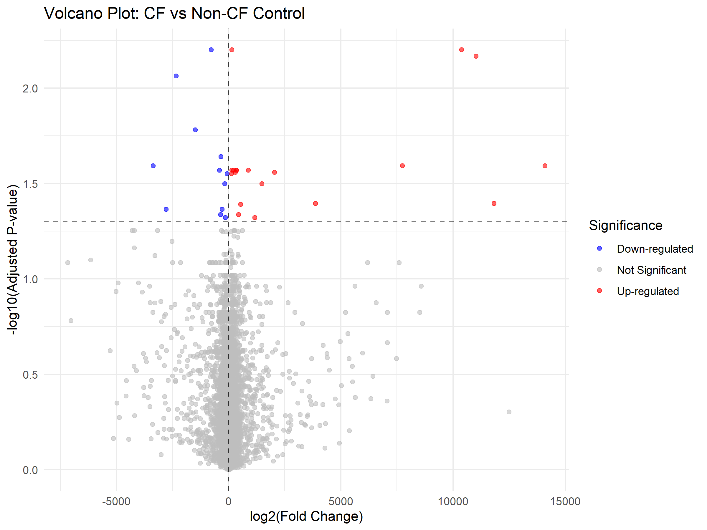

# Transcriptomic Profiling of CFTR F508del Mutation in Human Rectal Mucosal Epithelia

## Project Overview
This repository contains a complete computational biology pipeline in **R** for the differential expression analysis of Cystic Fibrosis (CF). The project investigates the transcriptomic shifts caused by the homozygous F508del (ΔF508) mutation in the Cystic Fibrosis Transmembrane Conductance Regulator (CFTR) gene, bridging the gap between molecular pathology theory and empirical genomic data.

## Biological Background
Cystic Fibrosis (CF) is an autosomal recessive disorder caused by pathogenic variants in the CFTR (cystic fibrosis transmembrane conductance regulator) gene on chromosome 7. More than 2,000 variants have been documented, but a single mutation—ΔF508, a three-base-pair deletion that removes phenylalanine at position 508—accounts for approximately two-thirds of all disease alleles in people of European ancestry. The mutation disrupts the proper folding and function of epithelial chloride channels. This project utilizes raw transcriptomic data to quantify how this specific mutation alters downstream gene regulatory networks in **human rectal mucosal epithelia** compared to healthy, non-CF controls.

## Dataset
*   **Source:** NCBI Gene Expression Omnibus (GEO)
*   **Accession:** [GSE15568](https://www.ncbi.nlm.nih.gov/geo/query/acc.cgi?acc=GSE15568)
*   **Platform:** Affymetrix Human Genome U133A Array (GPL96)
*   **Samples:** 29 total (16 CF homozygous F508del subjects vs. 13 healthy non-CF controls)

## Computational Pipeline & Methods
The analysis was conducted entirely in R, utilizing standard Bioconductor packages:
1.  **Data Acquisition:** Automated retrieval of the raw expression matrix and clinical metadata using `GEOquery`.
2.  **Data Wrangling:** Parsing and aligning clinical factors to strictly define the `non-CF` (Control) and `D508` (Disease) cohorts.
3.  **Differential Expression Analysis:** Fitting a linear model and applying the Empirical Bayes method via the `limma` package to ensure robust statistical validity across the samples.
4.  **Probe Annotation:** Mapping Affymetrix manufacturer IDs to standardized human Gene Symbols using the `hgu133a.db` database.
5.  **Data Visualization:** Constructing high-resolution Volcano Plots using `ggplot2` to visualize significant up- and down-regulated genes across the genome.

## 📈 Key Results
*Significance Thresholds: |log2(Fold Change)| > 1 and Adjusted P-value (FDR) < 0.05*

 

The exported results (`CFTR_F508_Differential_Expression_Results.csv`) provide a comprehensive catalog of significantly altered genes, serving as potential biomarkers or targets for downstream functional enrichment analysis.

## 💻 Prerequisites & Reproduction
To replicate this analysis, run the provided R script (`CFTR_F508_Script.R`). 
Ensure you have R installed along with the following packages:
```R
install.packages(c("BiocManager", "ggplot2"))
BiocManager::install(c("GEOquery", "limma", "hgu133a.db"))
